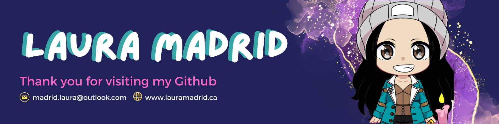

## 

<h4 align="center">Computer Science Specialist focused on Computer Vision, Machine Learning, and Robotics. Passionate about applying AI for good, especially in Human-Computer Interaction (HCI) and healthcare.</h4>

  
  
  

### A bit about me:

- 🎓 Specialist in Computer Science from the University of Toronto, applying to grad school to start September 2025
- 🤖 Focus areas: Computer Vision, Machine Learning, Robotics, HCI
- 🚀 Aspiring to become a Computer Vision Wizard
- 💡 Looking to collaborate on meaningful projects that can make a positive impact
- 💬 I speak: English (Fluent), Spanish (Native), French (Fluent), and Italian (basic comprehension).
- 🤝 Feel free to email me at **madrid.laura@outlook.com**

---

### **Languages and Tools:**

 
   
   
   
   
   
   
   
   
   
   
   
  
   
   
   
   
   
   
   

---

### **Top Languages:**

---

<h3 align="center"> ⬇️⬇️⬇️⬇️⬇️ Checkout my projects below ⬇️⬇️⬇️⬇️⬇️ </h3>